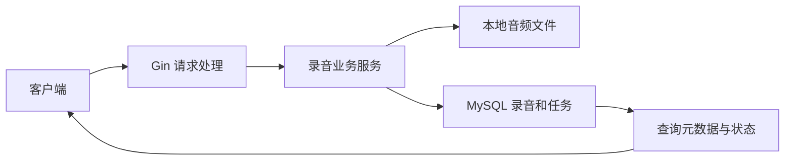

# 录音转写服务

使用 Go、Gin、GORM 和 MySQL 实现录音上传、异步 Mock 转写和真实 DeepSeek 摘要，原始音频保存到本地磁盘。一键启动与最终运行验收仍在后续批次完成。

## 本地运行

需要 Go 1.26 和 MySQL 8。先由数据库管理员创建数据库及具有该库读写权限的账号，再在空库执行建表 SQL。以下账号、库名和地址须与自己的环境一致：

```bash
mysql -h 127.0.0.1 -u audio -p audio_recording < migrations/001_init.sql
cp .env.example .env
```

编辑 `.env`，填入实际 `MYSQL_DSN` 和 `DEEPSEEK_API_KEY`。示例文件和 `.env` 不会被 Go 程序自动读取；使用下面命令导入 shell 环境后启动，含空格或 shell 特殊字符的值须在 `.env` 中正确引用：

```bash
set -a
. ./.env
set +a
go run ./cmd/server
```

默认监听 `127.0.0.1:8080`，文件目录为 `./uploads`。数据库必须可连接，表必须提前创建；程序不会自动迁移。`GET /health` 返回 200 只表示 HTTP 服务可响应。

## 当前接口

| 方法和路径 | 输入与行为 |
|---|---|
| `POST /v1/recordings` | multipart 字段 `file`，且只提交一个文件；成功返回 201 和 `recording_id`、`task_id`、`status: pending` |
| `GET /v1/tasks/{id}` | 查询状态、重试次数、错误信息及时间字段 |
| `GET /v1/recordings/{id}` | 查询元数据和结果字段；尚未生成的字段为 null |
| `GET /v1/recordings?page=1&page_size=20` | 返回 `items`、`total`、`page`、`page_size`；按创建时间、ID 倒序 |

上传非空文件，扩展名为 wav、mp3、m4a、aac（不区分大小写），文件上限按 50 MiB，即 52,428,800 字节执行；不检查音频编码内容。整个 multipart 请求另留 1 MiB 开销。原始文件名仅用于展示，磁盘文件使用服务端随机名称。

分页默认 `page=1`、`page_size=20`；范围分别为 1～1,000,000 和 1～100。显式空值、重复分页参数和非法数字返回 400。详情 ID 必须是正 uint64，合法 ID 不存在时返回 404。

```bash
curl -F 'file=@./sample.wav' http://127.0.0.1:8080/v1/recordings
curl http://127.0.0.1:8080/v1/tasks/1
curl http://127.0.0.1:8080/v1/recordings/1
curl 'http://127.0.0.1:8080/v1/recordings?page=1&page_size=20'
```

先提供本地音频文件，并将查询 ID 换成实际上传响应中的值。统一错误格式为：

```json
{"error":{"code":"not_found","message":"resource not found"}}
```

参数错误返回 400，不存在返回 404，上传超限返回 413，内部故障返回 500。请求响应不暴露服务端存储路径。

## 架构与表结构



`recordings` 保存文件展示名、存储路径、大小及后续的转写、摘要、要点、待办。`tasks` 保存录音关联 ID、状态、重试次数、失败阶段、错误及起止时间。`tasks.recording_id` 的唯一约束保证一条录音最多一个任务，外键拒绝无效关联。SQL 位于 `migrations/001_init.sql`。

上传先保存文件，再在短事务里创建录音和任务；两次 INSERT 失败会回滚并尝试清理文件。COMMIT 报错可能发生在数据库已提交之后，因此保留文件并返回 `upload_result_unknown`，需根据日志核验后再决定是否重传。普通数据库事务不能原子管理磁盘文件。进程在文件写入后崩溃可能遗留孤立文件。

列表采用 COUNT 与一次 LEFT JOIN，查询次数不随条目数逐条增加；排序使用创建时间和 ID，时间相同时仍有确定顺序。列表总数与条目是两条查询，并发增删时不承诺同一快照。

## 验证与当前边界

```bash
go test ./...
python3 scripts/check-mysql.py
```

未设置 `TEST_MYSQL_DSN` 的普通 Go 测试会跳过数据库集成部分。隔离检查脚本需要 Docker，创建临时 MySQL 并在结束后清理。上传与查询已通过真实 MySQL 的阶段测试；这不等于完整业务端到端验收。

当前后台每秒领取 pending，使用 goroutine 执行随机 5～15 秒、约 20% 失败的 Mock 转写；成功保存 transcript 后调用真实 DeepSeek，完整结果与 done 同事务提交。服务仅支持单实例，不限制同时执行任务数。一键启动和可导入 API 文件仍待完成；本节会随各功能验收更新。项目不提供鉴权、前端、真实 ASR、自动重试、SSE、上传幂等或公网部署。

## 真实摘要调用

默认 `DEEPSEEK_BASE_URL=https://api.deepseek.com`、`DEEPSEEK_MODEL=deepseek-v4-flash`，密钥通过 `DEEPSEEK_API_KEY` 注入。缺少密钥启动失败，不降级为 Mock。客户端使用非思考、非流式 JSON 输出，总超时60秒，不自动重试；转写输入最多64KiB、响应最多1MiB。

只有正常结束且输出符合 summary非空字符串、key_points/todos字符串数组（允许空数组）时，结果才能落库。超时、HTTP失败、JSON或字段格式错误进入 failed，错误阶段为 summarizing。日志不记录密钥或供应商完整响应。配置与调用约定参考 [DeepSeek JSON输出](https://api-docs.deepseek.com/guides/json_mode/) 和 [思考模式](https://api-docs.deepseek.com/guides/thinking_mode/)。

## 手动重试

`POST /v1/tasks/{id}/retry` 仅接受 failed，返回202和原recording_id/task_id及pending。任务和录音在同一事务中锁定，清空旧结果、错误及执行时间，retry_count加一，从转写重新执行。同一失败状态的并发请求只接受一次，其余返回409；不存在404，非法ID400。不自动重试，重新摘要可能再次产生API费用。

## 删除录音

`DELETE /v1/recordings/{id}` 只接受done或failed，处理中返回409，不存在404，成功204。先锁任务再锁录音，防止与重试交错；先删文件，再删任务和录音。文件不存在视为已清理，其他文件错误返回500且保留记录。文件已删除后若SQL/提交失败，数据库可能保留记录：根据日志核验，排除数据库故障后再次DELETE。文件不能参与数据库回滚，本项目没有自动补偿系统。

## 服务重启与退出

仅支持单实例。启动监听前将遗留transcribing/summarizing标为failed（service_interrupted），保留已有阶段结果，需手动重试；pending继续排队。不同端口启动第二个实例也不受支持，因为它会错误地处理中断状态。

SIGINT/SIGTERM会停止领取任务、取消后台外部调用，HTTP最多等待5秒关闭，后台最多等待10秒收尾。强制退出或数据库不可写可能遗留处理中状态，下次启动按上述规则处理。取消不等于自动重试，也不是阶段续跑。
