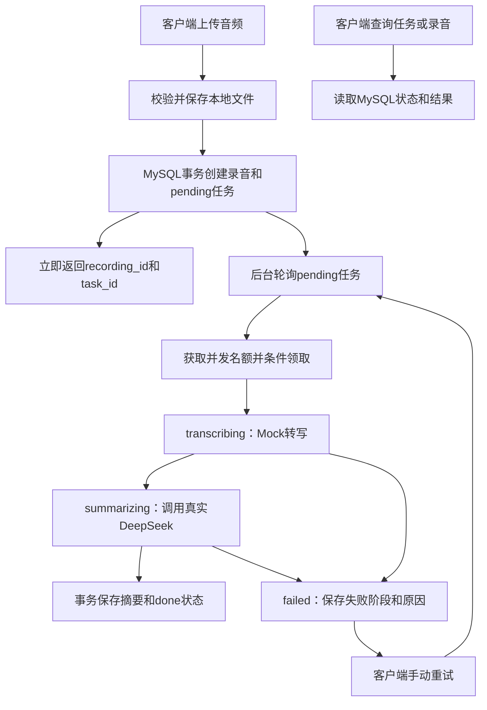

# 录音转写服务

使用 Go、Gin、GORM 和 MySQL 实现。上传音频后返回任务 ID，后台处理转写和摘要，通过接口查询进度与结果。

转写按题目要求使用 Mock：等待5～15秒，约20%概率失败，成功返回固定会议文本，**不会识别音频的真实内容**。摘要调用真实 DeepSeek，返回一句话摘要、要点和待办。

## 已实现的功能

- 上传音频：支持 mp3、wav、m4a、aac，文件非空，最大50 MiB。只检查扩展名和大小，不检查音频编码。
- 异步处理：上传保存后返回，不等待转写和摘要完成。
- 查询：任务状态、录音详情、分页录音列表。
- 失败重试：仅 failed 任务可重试，复用任务 ID，清空旧结果，重试次数加1。
- 删除：仅 done 或 failed 可删除，同时清理音频文件、录音和任务记录。pending、transcribing、summarizing 返回409，需等待任务结束后删除；当前不提供取消处理中任务的接口，避免后台继续读写已删除的数据。
- 重启处理：遗留的处理中任务标记为 failed，错误码为 service_interrupted；pending 任务继续排队。

额外实现了后台并发限制。`WORKER_CONCURRENCY` 默认是3，使用缓冲 channel 控制同时执行的任务数，数据库中的 pending 任务作为队列。名额覆盖转写和摘要整个过程，任务结束后释放，满载时不继续领取。

## 启动

需要 Docker 和 Docker Compose。首次构建需要联网下载镜像和依赖。

```bash
cp .env.example .env
```

在 `.env` 中填写 `DEEPSEEK_API_KEY`，然后启动：

```bash
docker compose up --build -d
docker compose ps
curl --noproxy '*' http://127.0.0.1:8080/health
```

返回 `{"status":"ok"}` 表示 HTTP 服务已启动，模型是否可用需要通过上传任务验证。默认模型是 `deepseek-v4-flash`，没有密钥会启动失败。

常用配置：

| 配置 | 说明 |
| --- | --- |
| `DEEPSEEK_API_KEY` | DeepSeek 密钥，必须填写 |
| `HTTP_PORT` | Compose 对外端口，默认8080；端口冲突时修改 |
| `WORKER_CONCURRENCY` | 后台并发数，默认3，必须为正整数 |
| `MYSQL_PASSWORD` / `MYSQL_ROOT_PASSWORD` | 数据库密码，服务器部署时使用独立密码 |

不要提交 `.env`。首次启动会初始化数据库，之后复用已有数据卷；修改配置里的数据库密码不会自动修改已有数据库账号。

```bash
# 查看日志
docker compose logs -f api

# 停止、重新启动，数据保留
docker compose stop
docker compose up -d
```

数据库和音频保存在 Docker 卷中，日常停止服务不要使用 `docker compose down -v`，它会删除数据卷。

## 接口调试

Apifox 导入 [docs/apifox.openapi.json](docs/apifox.openapi.json)，服务地址设置为 `http://127.0.0.1:8080`。也可以使用 [api.http](api.http) 或下面的 curl 命令。

| 方法 | 路径 | 说明 |
| --- | --- | --- |
| GET | `/health` | 健康检查 |
| POST | `/v1/recordings` | 上传，form-data 字段名为 file，成功返回201 |
| GET | `/v1/tasks/{id}` | 查询任务状态和失败原因 |
| GET | `/v1/recordings/{id}` | 查询录音、转写文本和摘要 |
| GET | `/v1/recordings?page=1&page_size=20` | 分页列表，按创建时间和 ID 倒序 |
| POST | `/v1/tasks/{id}/retry` | 重试失败任务，成功返回202 |
| DELETE | `/v1/recordings/{id}` | 删除终态录音，成功返回204 |

准备一份本机音频，替换命令中的文件路径：

```bash
curl --noproxy '*' -F 'file=@test.mp3' http://127.0.0.1:8080/v1/recordings
```

上传返回示例：

```json
{"recording_id":1,"task_id":1,"status":"pending"}
```

分别使用返回的 task_id 和 recording_id 查询，两者不保证相同：

```bash
curl --noproxy '*' http://127.0.0.1:8080/v1/tasks/1
curl --noproxy '*' http://127.0.0.1:8080/v1/recordings/1
```

任务成功时经过 `pending → transcribing → summarizing → done`。失败为 `failed`，查看任务响应的 `failed_stage`、`error_code` 和 `error_message`，再决定是否重试。

```bash
curl --noproxy '*' -X POST http://127.0.0.1:8080/v1/tasks/1/retry
curl --noproxy '*' -X DELETE http://127.0.0.1:8080/v1/recordings/1
```

参数错误返回400，资源不存在返回404，状态不允许操作返回409，上传超限返回413，内部错误返回500。错误响应统一为：

```json
{"error":{"code":"state_conflict","message":"only failed tasks can be retried"}}
```

## 实现思路



文件先保存到磁盘，再用事务创建 recordings 和 tasks。后台每秒查询 pending 任务，先获取并发名额，再通过带状态条件的 UPDATE 领取，更新成功才开始处理。

转写和摘要调用不放在数据库事务里。每个阶段完成后，将结果与任务状态一起提交，避免出现状态完成但结果没保存的情况。失败重试从转写重新开始，不是从中断位置继续。

目前只支持单实例，没有接入 Redis 或消息队列。文件系统和数据库不能一起回滚：上传提交结果不确定时保留文件并返回 upload_result_unknown；删除文件后如果 SQL 失败，需要核验后再次删除。相关日志用于排查。

## 表结构设计

建表脚本见 [migrations/001_init.sql](migrations/001_init.sql)，由 MySQL 在首次初始化空数据卷时执行。

| 表 | 主要字段 | 用途 |
| --- | --- | --- |
| `recordings` | `id`、`original_filename`、`storage_path`、`file_size` | 保存音频信息，文件内容放本地磁盘 |
| `recordings` | `transcript`、`summary`、`key_points`、`todos` | 保存转写和摘要；要点、待办使用 JSON 数组，未生成时为 NULL |
| `tasks` | `id`、`recording_id`、`status`、`retry_count` | 保存处理状态和手动重试次数 |
| `tasks` | `failed_stage`、`error_code`、`error_message`、`started_at`、`finished_at` | 定位失败原因并记录处理时间 |
| 两表共有 | `created_at`、`updated_at` | 记录创建和更新时间 |

`tasks.recording_id` 通过外键关联 `recordings.id`，并有唯一约束，每条录音最多一个任务。重试复用任务 ID、清空旧结果并增加计数，因此列表关联的任务就是当前最新状态，不额外维护尝试历史。删除时先删任务再删录音。

录音表的 `(created_at DESC, id DESC)` 索引用于倒序分页；任务表的 `(status, created_at, id)` 索引用于按顺序领取 pending 任务。状态字段通过 CHECK 约束限定为 pending、transcribing、summarizing、done、failed。

## 测试

执行完整验收：

```bash
# 本地没有此镜像时先下载
docker pull mysql:8.4.10
python3 scripts/check-all.py
```

需要 Python 3、Go 1.26、Docker，以及运行 Go 竞态检测所需的 C 编译器。脚本运行静态检查、竞态检测、隔离 MySQL 集成测试和真实 HTTP 进程测试，不操作业务数据库，也不调用真实 DeepSeek。

覆盖上传边界、查询、状态流转、摘要异常、事务回滚、并发重试、删除、中断处理和后台并发上限。成功显示 `ALL PASS`，日志路径会打印在终端。详细说明见 [scripts/TESTING.md](scripts/TESTING.md)。

只运行 `go test ./...` 时，如果没有设置 `TEST_MYSQL_DSN`，数据库测试会跳过，不能当作完整验收通过。

## 服务器部署

提供镜像打包脚本和服务器启动脚本，操作见 [deploy/README.md](deploy/README.md)。服务器部署配置将 API 发布到宿主机8080端口，MySQL 不开放宿主机端口。放行服务器防火墙和云安全组的 TCP 8080 后，通过 `http://服务器公网IP:8080` 访问，Apifox 使用相同地址。

当前演示地址：**http://192.144.168.226:8080**。2026-09-12 已通过公网真实 DeepSeek 上传验收，记录见 [docs/public-acceptance.md](docs/public-acceptance.md)。

```bash
curl --noproxy '*' http://192.144.168.226:8080/health
```

根目录 Compose 用于本地运行，仍只绑定回环地址；公网部署使用 `deploy/compose.yaml`。服务没有前端页面，根路径 `/` 返回404；健康检查使用 `/health`。服务器使用独立数据库，需要重新上传并使用新返回的 ID。

## 已知限制与未完成项

- 转写是 Mock，未实现真实语音识别。
- 未实现失败自动重试、SSE 摘要流和上传幂等。
- 重启后 pending 继续排队，处理中任务标记 failed，需手动重试，不是自动恢复执行。
- 仅终态录音可删除，不支持取消处理中任务；文件系统与数据库不能一起回滚，边界见上文。
- 只支持单实例，未实现鉴权；公网演示接口可被访问者上传、查询和删除终态录音，上传会调用真实 LLM。
