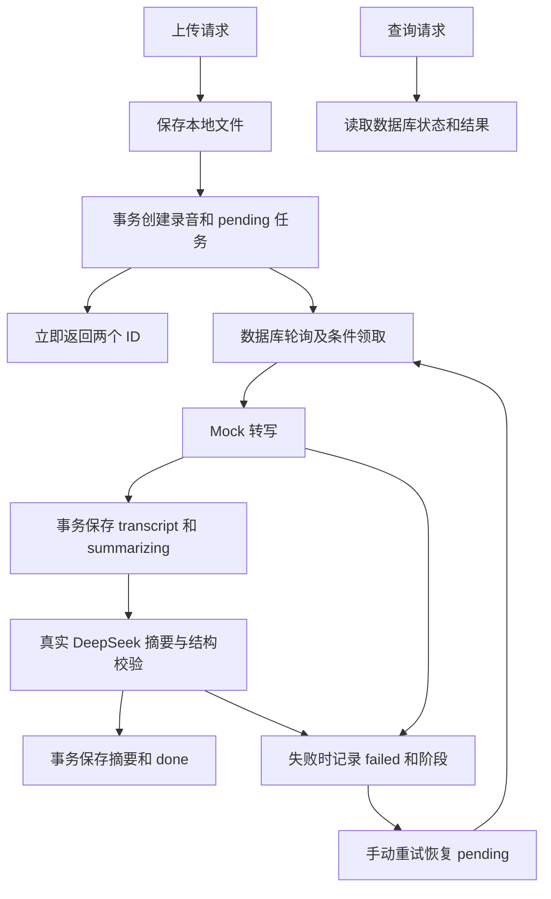

# 录音转写服务

Go + Gin + GORM + MySQL 后端。上传音频后立即返回任务，后台执行 Mock 转写和真实 DeepSeek 摘要，支持查询、失败重试及删除，限定单实例。

## 一键启动

需要 Docker Engine/Desktop 和 Docker Compose，首次构建需要网络下载依赖。Go 依赖默认使用 `https://goproxy.cn,direct`，可通过 GOPROXY 覆盖，保留校验和验证。

```bash
cp .env.example .env
# 编辑 .env，填写 DEEPSEEK_API_KEY；不要提交真实密钥。
docker compose up --build -d
curl http://127.0.0.1:8080/health
```

如果 shell 已设置 `DEEPSEEK_API_KEY`，可以直接执行启动命令；shell 环境变量优先于 Compose 的 `.env`。默认模型为 `deepseek-v4-flash`，缺少密钥会明确失败，不会降级为 Mock 摘要。端口占用时在 `.env` 设置 `HTTP_PORT=8081`，同步修改请求地址。

```bash
docker compose ps
docker compose logs -f api
docker compose stop
docker compose up -d
```

MySQL 和音频使用独立持久卷，普通 stop/down 不删除数据。首次空卷自动执行 `migrations/001_init.sql`，已有库不会重复初始化。不要为日常重启使用 `docker compose down -v`，它会删除数据卷。修改 `.env` 中数据库密码不会自动修改已有卷内的账号，必须在数据库中同步修改。

HTTP 仅发布到本机，MySQL 不发布宿主端口；示例数据库密码仅供本地使用。API 容器以非 root 用户运行。健康检查只验证 HTTP 响应，不代表 DeepSeek 持续可用。

## 接口演示

将一份真实音频放在本地，替换下面的文件路径。也可打开仓库的 `api.http`（例如 VS Code REST Client），按说明填写文件和两个 ID。

```bash
curl -i -F 'file=@/你的音频路径/sample.wav' http://127.0.0.1:8080/v1/recordings
# 使用上传响应中的实际 ID；录音 ID 和任务 ID 不保证相同。
curl http://127.0.0.1:8080/v1/tasks/1
curl http://127.0.0.1:8080/v1/recordings/1
curl 'http://127.0.0.1:8080/v1/recordings?page=1&page_size=20'
curl -i -X POST http://127.0.0.1:8080/v1/tasks/1/retry
curl -i -X DELETE http://127.0.0.1:8080/v1/recordings/1
```

| 接口 | 成功响应 | 规则 |
|---|---|---|
| `POST /v1/recordings` | 201，recording_id/task_id/status | multipart 字段 file，立即返回 pending |
| `GET /v1/tasks/{id}` | 200，任务状态与执行信息 | 包含阶段、重试次数、错误及时间 |
| `GET /v1/recordings/{id}` | 200，录音与结果 | transcript/summary/key_points/todos，未生成为 null |
| `GET /v1/recordings?page=&page_size=` | 200，items/total/page/page_size | 创建时间、ID 倒序，含关联任务状态 |
| `POST /v1/tasks/{id}/retry` | 202，原 ID 和 pending | 仅 failed 接受，复用任务，从转写重新执行 |
| `DELETE /v1/recordings/{id}` | 204，无正文 | 仅 done/failed；删除文件和关联数据 |

音频非空，扩展名 wav/mp3/m4a/aac，不区分大小写；只检查扩展名，不验证音频编码。大小按 50 MiB（52,428,800 字节）执行，整个 multipart 请求另留 1 MiB 开销。原名只用于展示，存储文件使用服务端随机名称，查询不返回磁盘路径。

ID 为正 uint64。分页默认 page=1、page_size=20，上限分别为 1,000,000 和 100；空值、重复参数和非法数字拒绝。空列表返回200和 `[]`，单条不存在返回404。

参数错误400，不存在404，状态冲突409，上传超限413，内部故障500。统一错误正文：

```json
{"error":{"code":"state_conflict","message":"only failed tasks can be retried"}}
```

## 架构与状态



状态为 `pending → transcribing → summarizing → done`，处理阶段失败进入 failed。Mock 随机等待5～15秒，约20%失败，成功返回固定会议文本，**不识别真实音频**。真实摘要默认调用 DeepSeek 官方 API，非思考、非流式 JSON 输出；超时60秒，不自动重试。

客户端验证 HTTP 状态、完整结束原因、JSON 和字段类型：summary 非空字符串，key_points/todos 为字符串数组，允许空数组，拒绝缺失/null/错误类型。输入最多64 KiB、响应最多1 MiB。网络、超时或结构错误进入 failed；日志不记录密钥或完整供应商响应。JSON模式参考 [DeepSeek 官方文档](https://api-docs.deepseek.com/guides/json_mode/)。

## 表结构和设计取舍

- `recordings`：文件原名、路径、大小、转写文本、摘要、JSON要点/待办和时间。
- `tasks`：录音关联ID、五状态、重试次数、失败阶段、错误和执行时间。唯一关联保证每条录音最多一个任务，外键拒绝无效引用。
- 迁移用显式 SQL，不调用 AutoMigrate；完整列与约束见 `migrations/001_init.sql`。

选择数据库轮询和 goroutine，减少外部依赖。每秒读一批 pending，以带旧状态条件的 UPDATE 领取，RowsAffected=1 才执行。读取批大小100不代表并发上限；当前不限制同时执行任务数。

文件保存后才开始上传事务。转写与摘要调用都在事务外，结果和对应状态分别在短事务中一起提交。跨表变更统一先锁任务、再操作录音。

重试锁定任务并确认 failed，同事务清空旧结果与错误、计数加一、恢复 pending。一组竞争同一失败状态的请求只有一个接受；不提供跨多次失败的幂等键。重试从头开始，可能再次产生模型费用。

列表用 COUNT 和一次 LEFT JOIN，避免应用逐条查询任务。创建时间加ID保证同一数据集的排序确定性；两条查询不使用快照事务，并发增删时总数与条目可能短暂不一致，OFFSET翻页也可能重复或遗漏。

## 重启、删除与已知边界

只支持一个 API 实例。启动前将遗留 transcribing/summarizing 标为 failed，错误码 `service_interrupted`，保留阶段结果，允许手动重试；pending 继续排队。不同端口启动第二实例也不受支持，它可能将第一实例的活动任务误标失败。此行为不是阶段续跑或自动重试。

SIGINT/SIGTERM 停止领取并取消后台调用；HTTP 关闭最多等待5秒，后台收尾最多等待10秒。强制退出或数据库不可写时可能遗留活动状态，由下次启动收尾；不承诺运行期自动恢复。

文件系统不参加 MySQL 事务：

- 上传插入明确失败时尝试删除文件；提交结果不确定时保留文件，返回 `upload_result_unknown`。按日志中的 ID、路径核验数据库，确认未提交后再决定清理或重传。
- 保存文件后崩溃可能留下孤立文件，没有自动扫描补偿。
- 删除与重试使用相同锁顺序，活动任务拒绝删除。先删除文件，失败保留数据库；文件不存在视为已清理。若之后 SQL/提交失败，文件无法回滚，数据库恢复后核验并再次 DELETE 完成清理。

不提供真实 ASR、自动重试、SSE、上传幂等、并发上限、鉴权、前端、分布式协调或公网部署。

## 本地 Go 运行

需要 Go 1.26、MySQL 8。由管理员预先创建空库与账号，并执行一次迁移：

```bash
mysql -h 127.0.0.1 -u audio -p audio_recording < migrations/001_init.sql
cp .env.example .env
# 编辑 MYSQL_DSN 和 DEEPSEEK_API_KEY，使用你自己的数据库账号。
set -a
. ./.env
set +a
go run ./cmd/server
```

直接 Go 程序不自动读取 `.env`，以上命令通过 shell 导入；含 shell 特殊字符的值需正确引用。Compose 自动读取 `.env`，并使用容器网络地址构造 DSN，不采用本地 MYSQL_DSN。服务默认监听127.0.0.1:8080；WSL若出现IPv4回环连接异常，可将本地 HTTP_ADDR 设置为 `[::1]:8080`，使用对应IPv6地址访问。

## 验证

```bash
go test ./...
go test -race ./...
go vet ./...
python3 scripts/check-mysql.py
```

未设置 TEST_MYSQL_DSN 时，普通 Go 测试跳过数据库集成部分，不能视作数据库通过。隔离脚本需要 Docker、本地 `mysql:8.4.10` 镜像（缺少时先 `docker pull mysql:8.4.10`），创建一次性测试库，结束后清理容器与匿名卷，不操作业务库。

测试覆盖上传与查询、状态流转、SQL故障回滚、LLM超时和坏响应、并发重试、删除竞争及中断处理。HTTP替身优先IPv6回环，不可用时回退IPv4。Mock概率在生产保留，测试用可控转写器和摘要器验证失败，无生产故障注入接口。
